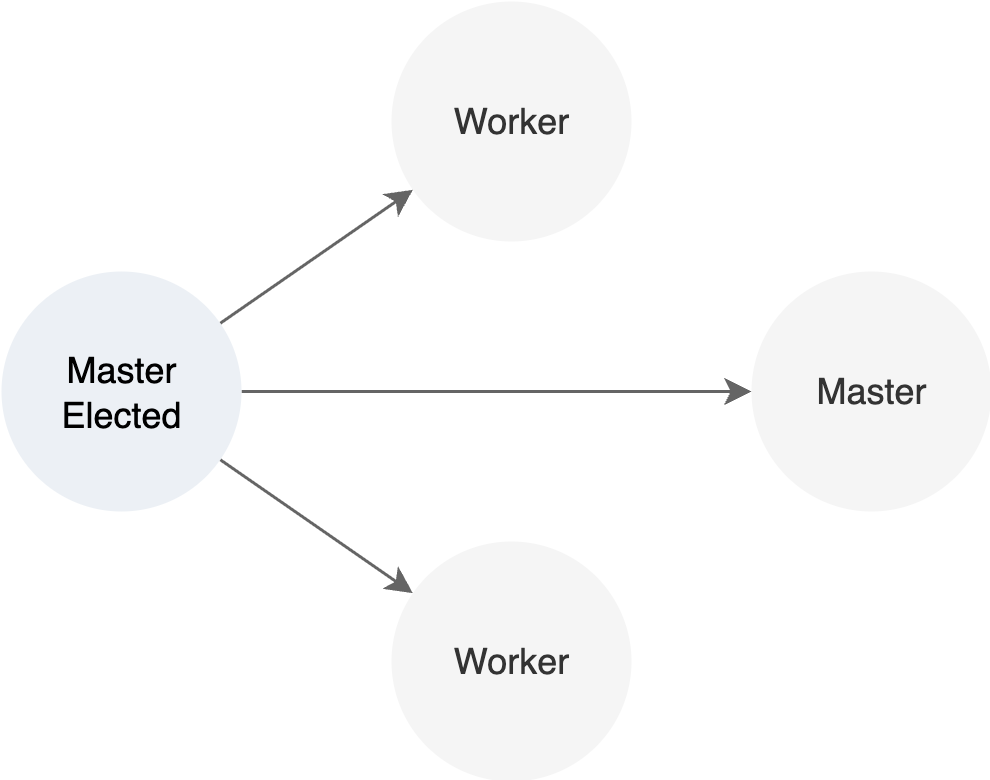
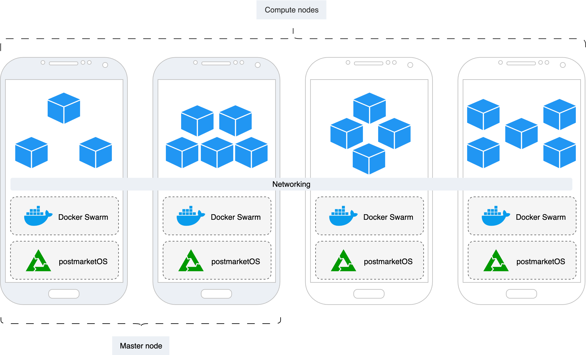
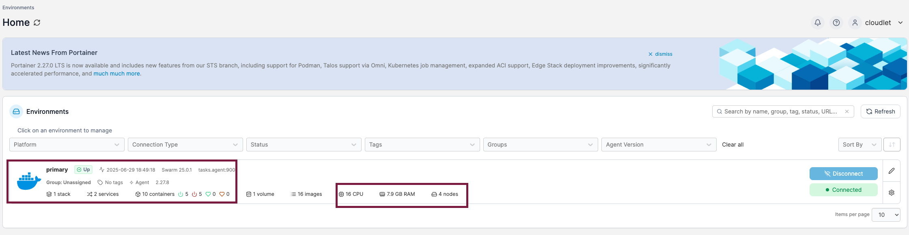
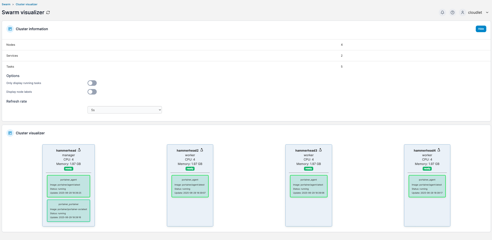
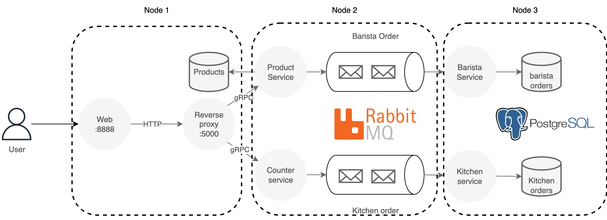
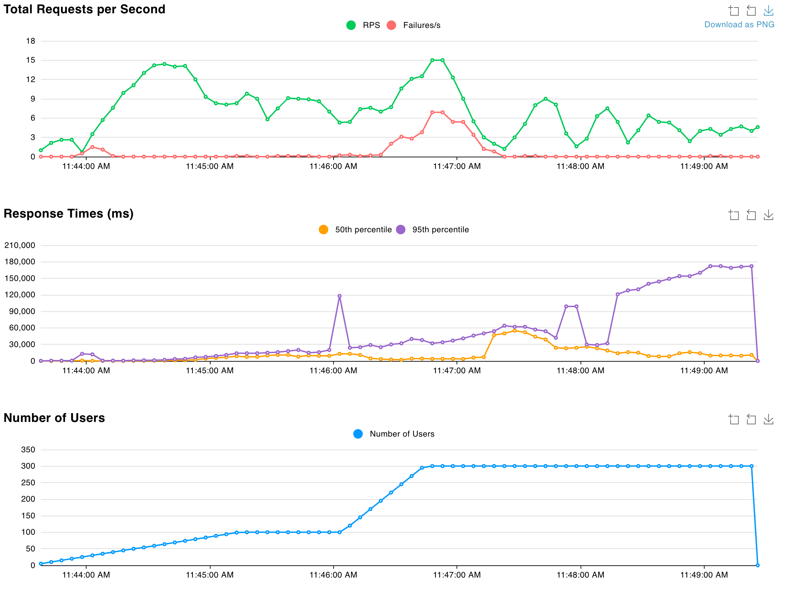

# Overview - Top botton view

The cloudlet in composed by one or more Pixel 4 phones. The cluster is being managed by docker swarm, this one is the responable of creating an overlay network layer that allows containers reached each other using the same ip adress.  Moreover, docker swarm is the responsable of distributing the load of the containers across each node. 

In order to have docker swarm, the only requisite is to have docker installed in each device. 

Each mobile phone has PostmaketOS as linux kernel.

Each mobile phone has one role in the docker swarm cluster, it could be ether Master (M) or Compute (C) node. Both of them (M, C) can and will host docker containers, the only difference is that only masters can deploy, update, or delete a stack in the cluster. When a cluster has more than one Master, then election process happens to select only one leader for the whole cluster, the remaining M nodes will be as candidates, as soon as the leader is not reacheble, the Master nodes will create a new term.



> :warning: When the cluster has two active master, the leader election does not work.



# Actual stacks.

The cluster has two stacks, one for adminstration and one application stack for testing.

> ⚠️ Be aware that the cluster made of Pixel 4 are a **ARMx32** bits!, What this means is that whatever is deployed must be compiled to linux/arm/v7 architecture in docker. This is a pain in the ass 🫠.


## Administration - Portainer

[portainer_agent](stacks/portainer_agent.yml) has two containers, an agent that will be deployed in all nodes and a administration palenl that will be only deploy on the manager with only one replica.

> ⚠️ The **MASTER_NODE_IP** is the ip of one of the master nodes, or the leader ip address, this IP will be the entry point for all nodes not matter where are they deployed.

This service could be accessed by *http://**MASTER_NODE_IP**:9000*, credentials on Aug 22 was admin/Asdfghjkl123456789* but this could be change by [re-deploying](#deploy-and-update-an-stack) the stack.




## Go coffe app - Demo application

> ☢️ The stack has a reverse proxy, this one is accesible by using an IP address, if you deploy this stack you should update the param services.web.environment.**REVERSE_PROXY_URL** with the master node Ip address.

[go_coffe.yml](stacks/go_coffe.yml) is a demo app in golang that helps to show that the cluster is able to support a whole application with backend, frontend, database and event streaming sources. Go coffe is compose of:

* postgres:14 
* rabbitmq:3.11
* Six golang applications under juangonzalout dockerhub account.

All previous images are ARMx32, which makes them suitable for working on the cluster.



### Volume test on Go coffe app

This project also contains a volumen test located on [locustfile.py](load_test/locustfile.py). In order to run the test, [locust](https://docs.locust.io/en/stable/installation.html) should be installed in the host machine.

Once Locus is installed you should:

``` sh
$ cd load_test
$ locust
```

Then type the ip address of the master node and [start the test](https://docs.locust.io/en/stable/quickstart.html).


This is the last load test demo on the cluster.



# Hows to

## Connect to a phone

> ⚠️ All four phones has the same password **1234**

* You could use the screem, password **1234**
* You could connect them to a **linux** laptop by cable, then connect by ssh, same credentials to all phones.
    * user: cloudlet
    * password: 1234
    * The ip address will be the same for all the phones

``` bash
$ ssh cloudlet@172.16.42.1
```
* If you have access to then trhought network, then the connection is the same but with the Ip address.
     * user: cloudlet
    * password: 1234
``` bash
$ ssh cloudlet@IP_ADDRESS
```


## Set up a cluster

### Networking
If you have the networking aready set up (you could use ut-public) then you could go to the next section [Docker swarm](#docker-swarm) But I highly suggest to set up your own networking as you could set static DHPC, thus make all more easy later on.

For setting up the networking, it depends mainly on what router are you using, in my case I suggest working with the [Mango](https://www.gl-inet.com/products/gl-mt300n-v2/) router, it is cheap, small and works pretty good for this job. You maybe could find one asking to Ulrich Norbisrath.

As I have no idea which router you can use I can not expaling how to configure it. But, if you select the Mango, in 5 mins you could have all up and running with the help of Ulrich.

Once you have a netowking set up with SSID and password, then you could run the [setting_network.sh](scripts/setting_network.sh) script on every node


``` bash

$ sudo nmcli radio wifi on # Turn on wifi
$ sudo nmcli device wifi connect cloudlet password my-secure-password # connect to SSID cloudlet, pass my-secure-password
$ sudo nmcli connection modify cloudlet connection.autoconnect-priority 100 # Set this as the prefered WIFI
$ sudo nmcli connection delete "ut-public" # Forget about this one, just to avoid the node jumping from net to net

```

### Docker swarm

> ☣️ All phones have already docker installed, but this deamon does not start on bootstrap, thus every time the phones shutdown and turn on you should activate the docker deamon service

``` bash
$ sudo service docker start
```

Once docker is up, the next task is to create the cluster, for this you should run the next code only once in whatever phone

``` bash
$ docker swarm init --advertise-addr NODE_IP_ADDRESS
```

This will set up a new swarm cluster, then you could start adding nodes, you should select one of the next codes to get a token, it could be a master or a compute token node, usually a cluster should have in a good case 1, 3, 4 master nodes.


Get a worker/compute node token link
``` bash
$ docker swarm join-token worker
```


Get a master/manager node token link
``` bash
$ docker swarm join-token manager
```

Once you got your token, you should go to each other phone, make sure docker is running and then paste the token on each one of them, as an example:

> Example of joining other node into the cluster.
``` bash
$ sudo service docker restart
$ sudo docker swarm join --token SWMTKN-1-2bwi7gaoklegao52ce5ioiptbcdq70qleg8h8dswr9n29ah5a3-b8wlv3ut33gnwt5fnbbi0i8cb 192.168.1.246:2377
```

## Clean docker swarm

[remove_cluster.sh](scripts/setting_network.sh) script contains all the steps to remove a node from the cluster and to clean the space. You should run this script on every node, so first connect to each node and then run it.

On each node / phone you should:

``` bash
$ ssh cloudlet@IP_ADDRESS # Connect to the node
$ sudo service docker restart # make sure docker deamon is runnig
$ sudo docker swarm leave --force # Leave the cluster
$ sudo docker stop $(sudo docker ps -a -q) # Remove all active containers
$ sudo docker system prune -f # Clean old images, networking and volumes
```


## Deploy and update an stack

To deploy or update an stack is the command is the same.

On docker swarm we could deploy docker compose files using the next command:

``` bash
$ sudo docker stack deploy -c PATH_TO_DOCKER_COMPOSE.yml STACK_NAME
```

As an example, you could deploy the whole demo stack by running:

``` bash
$ cd stacks
$ sudo docker stack deploy --compose-file go_coffe.yml coffe
```

The same with portainer

``` bash
$ cd stacks
$ sudo docker stack deploy --compose-file portainer_agent.yml portainer
```
## Destroy an stack

To destroy an stack you should be aware of the stack name, then run 

``` bash
$ sudo docker stack rm STACK_NAME
```

## Useful commands

### WiFI
``` bash
$ nmcli device wifi list # Shows all the wifi networks
$ nmcli -f autoconnect-priority,name c # List connectios
```

### Containers
``` bash
$ sudo docker service ls # Shows all services
$ sudo docker service ps ID # Get information about a service
$ sudo docker service scale ID=# # Scale Id to # number
```

### Nodes information
``` bash
$ sudo docker node ls # List all the nodes on the cluster
```

# Actual passoword - Coud be potentially deprecated

## Wifi
http://192.168.1.1/cgi-bin/luci/
```
SSID: cloudlet
password: my-secure-password
```

## Portainer
```
user: cloudlet
pass: Asdfghjkl123456789*
```

## Every phone users
```
mungaX where x belongs to [2,3,4] or empty
1234
```

```
cloudlet
1234
```

```
By using screen
1234
```


